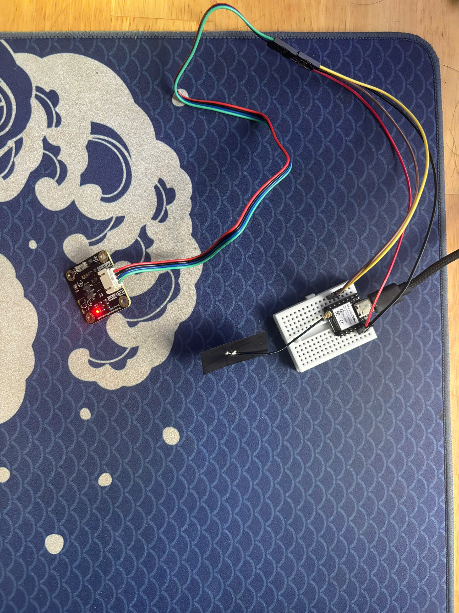
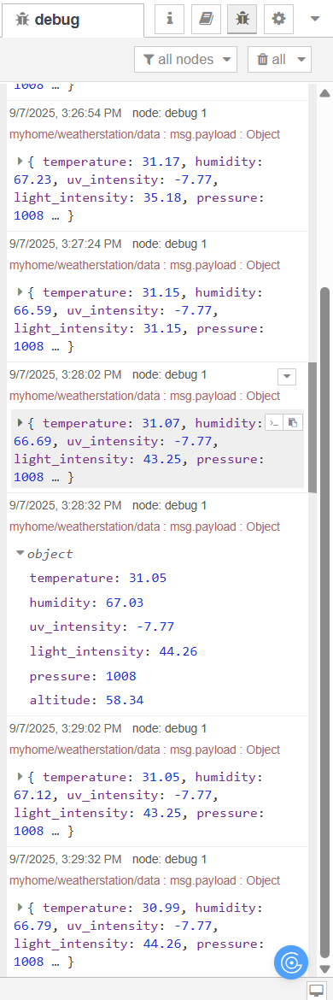
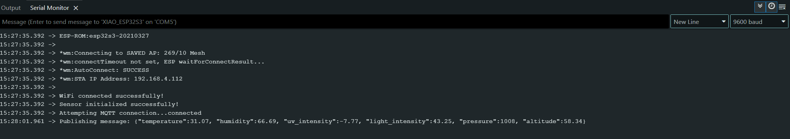
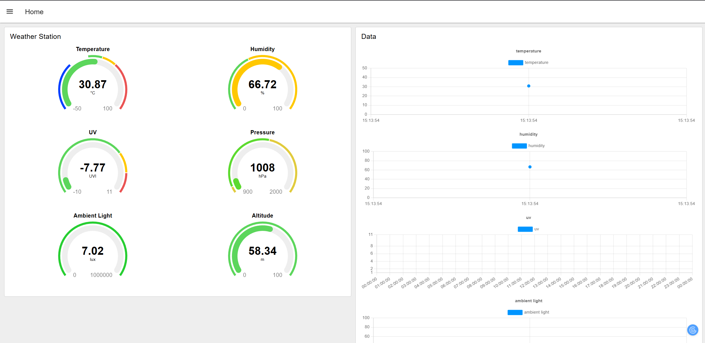

# Project Development Blog

## Day #1: Initial Setup, Brainstorming idea and preparation
I have an idea for setting up my own weather station for a pretty long time ago, but as a uni student, I probally have left it untouched for a little to long. 
So recently, since the weather where I live (HCM, Vietnam) has become a little too much unpredictable even for me, and the weather news accuracy is somewhat questionable in Vietnam (of course comparing to other developed countries,...). I thought, just for fun, why should I not start my own
weather station?

So I start researching, videos, images, and how it actually solve my problems. Since the start of 3d printing technology and the development of development boards with more powerful MCU, lots of projects including weather station has been made:

Here are a few videos that I have found on [Youtube](https://www.youtube.com/results?search_query=diy+weather+station)

[DIY 3D Printed IoT Weather Station Using an ESP32](https://www.youtube.com/watch?v=tBGwyXPJZEQ)  by Michael Klements

[Easy DIY Weather Station with ESP32 + WiFi + Adafruit IO | Battery Powered & 3D Printed](https://www.youtube.com/watch?v=uq0Maka7gSo) by J-Rat

and many others

All of them utilized a 3D printed shell or even some components making using 3D printed parts (eg. anemometer).

## So with this part, I can ensure that there is a substantial amount of guides in the community to help me if I get stuck in the future as well as this might be able to work

Then I continue to solve the second part of the question, how can I make this beneficial to my use case? Through school courses, I know that data can be used in many different approach, one of those is machine learning and AI. So I wonder, can I somehow later use the data gather by the weather station to perform prediction on weather in my area, specifically near my house?

So I then research on the practicality of this method, which yields somewhat very positive results:

[Probabilistic weather forecasting with machine learning](https://www.nature.com/articles/s41586-024-08252-9) by Ilan Price, Alvaro Sanchez-Gonzalez, Ferran Alet, Tom R. Andersson, Andrew El-Kadi, Dominic Masters, Timo Ewalds, Jacklynn Stott, Shakir Mohamed, Peter Battaglia, Remi Lam & Matthew Willson

[Machine learning to play growing role in weather forecasting, says DG](https://www.ecmwf.int/en/about/media-centre/news/2024/machine-learning-play-growing-role-weather-forecasting-says-dg) by ECMWF

This leads me to further invest my time into the project!

### Preparation

Then I start looking up on possible hardwares, espeacially sensors and the microcontroller I can use. 

### For the microcontroller:

* Arduino Uno:
  
  A link to the website Im using: [Arduino Uno R4](https://hshop.vn/arduino-uno-r4-minima-chinh-hang-original-made-in-italy)
 > This could be a potential board I use, its fit with most of the categories, along with my experience working with Arduino boards in general. However, its have limitation in wifi + bluetooth capabilities, as well as somewhat limited     size in ROM and RAM as well. 

* ESP32 (Seed Studio ESP32S3):
  
  A link to the website Im using: [Seed Studio Xiao ESP32S3](https://hshop.vn/mach-seeed-studio-xiao-esp32s3)
> This end up the board that I use, mainly because its can be practically be programmed using Arduino IDE, as well as its capabilites with Dual Core 240MHz Xtensa 32-bit LX7 processor, adequate amount of RAM and ROM and its capabilities using Wifi + Bluetooth and also the ability to use battery powered through a seperate IO pin and its compact size.

* STM32:
* 
A link to the website Im using: [STM32 Nucleo-144 development board with STM32F767ZI MCU](https://hshop.vn/kit-nucleo-f767zi-stm32-nucleo-144-development-board-with-stm32f767zi-mcu)

> Although STM32 has its advantages in low power consumption, its also required lots of extension board to be able to access to the features the ESP32 provide

* Raspberry Pico:

A link to the website Im using: [Raspberry Pi Pico W RP2040 + Wifi & Bluetooth](https://hshop.vn/mach-vi-dieu-khien-raspberry-pi-pico-w-rp2040-wifi-bluetooth)

> Although this provide the same feature with the ESP32, its processor has the advantages in processing power, however the ESP32 is more efficient in power usage, which is extremly important if I want to battery powered the weather station or using it with a Solar power panel

### For the sensors:

Initially Im planning to use a different combination of sensors to handle pressure and humidity [DHT11, DHT21](https://hshop.vn/nhiet-do-do-am-mua) and many others... However I have able to obtain a combine sensors from DFRobot - [SEN0501](https://hshop.vn/cam-bien-moi-truong-dfrobot-gravity-high-accuracy-temperature-humidity-pressure-ambient-light-and-uv-sensor), this has simplify the wiring and the size limitations of the project.

Along with it, Im using an [Optical Dust Sensor PM2.5 GP2Y1010AU0F](https://hshop.vn/cam-bien-bui-gp2) for meansuring the dust in the air, this is just the first version which Im planning to upgrade to a better version which use laser instead of LED for better accuracy - [DFRobot Gravity: PM2.5 Air Quality Sensor](https://hshop.vn/cam-bien-bui-dfrobot-gravity-pm2-5-air-quality-sensor-i2c)

### Optical Dust Sensor PM2.5:

### DFRobot Air Quality Sensor:

That is the main part along with other tools I already have at home or either can be bought from any electronic store like solder, breadboards, wires and some 3D printed parts for the casing as well, you can look through this 3D print services if you don't have a 3D printer - [3DMeo](https://www.3dmeo.vn/) - they are from the same corporation with the store where I bought the board and sensors, I have use them for some projects at school before and their quality is good enough, for me Im recently start my hobby into 3D printing so I will going to try it myself.

## Day #2: Start coding

So second day, I start with coding all of the code for implementing of the sensors on the board, the code can be found in the [src](src) folder of the project. For the first day, I test with initialized the boards, having it to read all information provided by the SEN0501 sensor, as well as public the data to an MQTT broker - [HiveMQ](https://www.hivemq.com/) - as JSON message, this can be later be use to display the information on other PCs, phones and devices.

Basically for the SEN0501 sensor, I set it up to use UART as its communication protocol for now, but in later iterations I will change it to I2C for a much more simple and faster circuit. Additional information that I read during the development of the intial setup can be found here:

- [What is MQTT?](https://aws.amazon.com/what-is/mqtt/?nc1=h_ls) by AWS
- [Understanding the Differences Between UART and I2C](https://www.totalphase.com/blog/2020/12/differences-between-uart-i2c/) by TotalPhase
- [HiveMQ Documentation](https://docs.hivemq.com/hivemq/latest/user-guide/index.html) by HiveMQ
- [Getting Started with Seeed Studio XIAO ESP32S3 Series](https://wiki.seeedstudio.com/xiao_esp32s3_getting_started/) by Seeed Studio
- [SKU SEN0501 Gravity Multifunctional Environmental Sensor](https://wiki.dfrobot.com/SKU_SEN0501_Gravity_Multifunctional_Environmental_Sensor) by DFRobot

The code can be run and able to publish the info to HiveMQ broker that I have set up

## Day #3: Bringing the Data to Life with Node-RED

With data successfully streaming to the cloud, the next logical step was to create a user interface to see it in real-time. Just looking at JSON messages isn't very exciting! I decided to use Node-RED for this, as it's a powerful visual tool for creating data flows and, more importantly, has an excellent dashboard UI.

I set up Node-RED locally on my PC using Docker, which creates a clean, portable environment for the server. The initial flow was simple: an mqtt in node to subscribe to my HiveMQ topic, a json node to convert the text message into a usable object, and a debug node to see the data.

This is where I hit my first real troubleshooting challenges:

MQTT Connection: The mqtt in node was stuck on "connecting...". I realized that for a secure connection to HiveMQ Cloud, I had to use port 8883 and explicitly enable the "Use TLS" option in the broker configuration.

Dashboard Not Updating: After getting connected, I added some gauge and text nodes, but they weren't showing any data. The debug panel showed the data arriving perfectly, but the UI was blank. After some research, I learned that the standard node-red-dashboard is being deprecated. I upgraded to the newer, official FlowFuse Dashboard 2.0, which required a different configuration. The key was to use a direct path to the data (e.g., payload.temperature) in the "Value" field, instead of the older {{payload.temperature}} syntax.

After fixing the value paths and adjusting the dashboard layout grid to fit my screen without scrolling, I finally had a working dashboard

## Day #4: Major Code Refinements - Dynamic Wi-Fi, I2C, and Security

While the project was working, the firmware was still very rigid. Having my Wi-Fi and MQTT credentials hardcoded was not practical or secure for a real device that I plan to share on GitHub. This day was dedicated to a major code cleanup.
1. Dynamic Wi-Fi Configuration with WiFiManager:

I integrated the brilliant WiFiManager library. Now, if the device can't connect to a known network, it automatically creates its own secure Access Point named "WeatherStation-Setup". I can connect to this with my phone, and a web page pops up allowing me to scan for networks and enter the password. This makes the device completely "headless" and easy to deploy anywhere.

2. Securing Credentials:
Uploading code with plain-text passwords to a public GitHub repository is a major security risk. To solve this, I implemented the standard "secrets header" method for the Arduino IDE. All sensitive information (the password for the setup portal and my MQTT broker credentials) is now stored in a separate secrets.h file. This file is then added to .gitignore, ensuring it's never uploaded to GitHub. The main sketch includes this local file and uses macros to access the credentials, keeping my code secure and shareable.

3. Switching to I2C:
As planned, I switched the SEN0501 environmental sensor from UART to I2C. This was a simple process:
Flipping the physical switch on the sensor board.
Moving the two data wires to the XIAO's I2C pins (D4 and D5).
Updating the code to use the Wire.h library and initialize the sensor with its I2C address (0x22).
The circuit is now simpler, and it frees up the hardware serial port for other potential uses.

## Day #5: The Key to Battery Life - Deep Sleep

This was the final and most important software update. To make the 8000mAh battery last for months, I refactored the code to use the ESP32's Deep Sleep mode.

The entire operational logic now runs once inside the setup() function. The device wakes up, connects to Wi-Fi, reads all the sensors, publishes the data to MQTT, and then immediately goes back to deep sleep for a 5-minute interval. The loop() function is now completely empty, as it's never reached. This simple change reduces the average power consumption by over 99% and is the key to long-term, autonomous operation.

